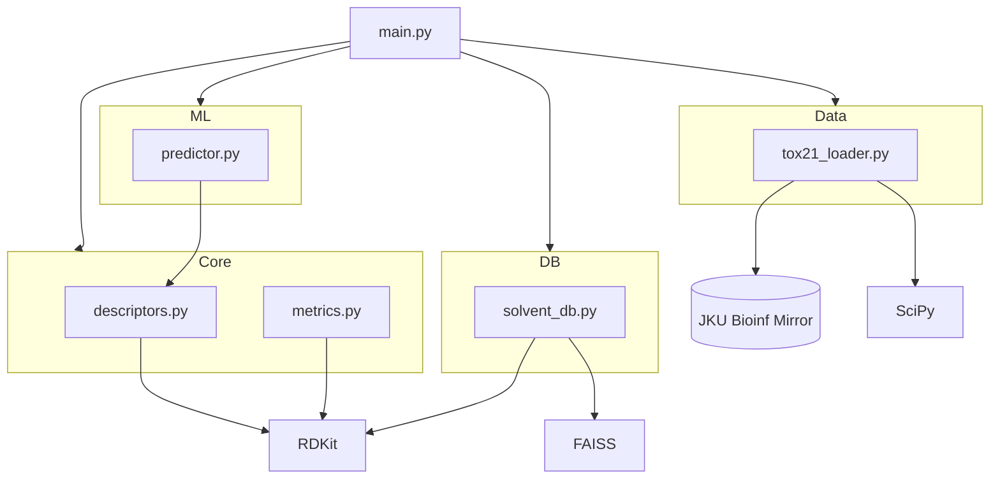

# Chemoinformatics Project

A modular toolset for molecular descriptor extraction, yield prediction, toxicity prediction, and green solvent ranking.

## Architecture



## Project Structure

- `src/core/`: Essential molecular calculations.
    - `descriptors.py`: RDKit descriptor extraction and feature preparation.
    - `metrics.py`: Green chemistry metrics calculation and solvent ranking.
- `src/ml/`: Machine learning logic.
    - `predictor.py`: Interaction with scikit-learn models and uncertainty quantification via Monte Carlo.
- `src/db/`: Database and search.
    - `solvent_db.py`: FAISS-powered molecular similarity search.
- `src/data/`: Dataset loaders.
    - `tox21_loader.py`: Auto-downloads and loads the Tox21 toxicology benchmark (12 assays, 12k compounds, dense + sparse features).
- `main.py`: Entry point and demonstration script.

## Getting Started

1. Install dependencies:
   ```bash
   pip install -r requirements.txt
   ```
2. Run the demo:
   ```bash
   python main.py
   ```
   On first run, Tox21 data files (~53 MB) will be downloaded to `data/tox21/`.
